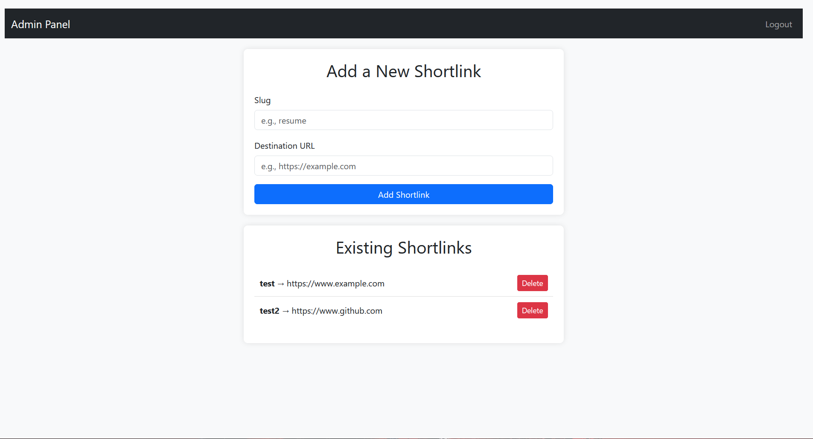

# Go - URL Redirection Service

A simple **URL redirection service** with an admin panel for managing custom shortlinks. Built with **Node.js**, **Express**, **MongoDB**, and **Bootstrap**.

---

## Features

- **Admin Panel**: Add, view, and delete custom shortlinks.
- **Authentication**: Secure login for the admin panel.
- **Modern UI**: Built with **Bootstrap** for a clean and responsive design.
- **Environment Variables**: Secure configuration using `.env` files.
- **MongoDB Integration**: Store shortlinks in a MongoDB database.

---

## Live Demo

You can access the live demo here: [https://go.prashantgiri360.com.np](https://go.prashantgiri360.com.np)

---

## Screenshots

### Admin Panel


### Login Page


---

## Getting Started

Follow these instructions to set up the project locally.

### Prerequisites

- **Node.js**: Download and install from [nodejs.org](https://nodejs.org/).
- **MongoDB**: Set up a MongoDB database locally or use [MongoDB Atlas](https://www.mongodb.com/cloud/atlas).

### Installation

1. **Clone the repository**:
   ```bash
   git clone https://github.com/prashantgiri360/go.git
   cd go
   ```

2. **Install dependencies**:
   ```bash
   npm install
   ```

3. **Set up environment variables**:
   - Rename the `.env.example` file to `.env`.
   - Update the values in the `.env` file with your MongoDB connection string and admin credentials.

4. **Start the server**:
   ```bash
   node index.js
   ```

5. **Access the app**:
   - Open your browser and go to `http://localhost:3000`.
   - Log in with the admin credentials specified in the `.env` file.

---

## Project Structure

```
go/
├── Assets/                 # Screenshots
├── views/                  # EJS templates
│   ├── admin.ejs           # Admin panel
│   ├── login.ejs           # Login page
├── models/                 # MongoDB models
│   ├── Shortlink.js        # Shortlink schema
├── db.js                   # MongoDB connection
├── passport.js             # Passport authentication setup
├── index.js                # Main server file
├── .env                    # Environment variables
├── .gitignore              # Files to ignore in Git
├── package.json            # Project dependencies
└── README.md               # This file
```

---

## Usage

### Admin Panel
- **Add a Shortlink**:
  - Enter a **slug** (e.g., `resume`) and a **destination URL** (e.g., `https://www.example.com/resume.pdf`).
  - Click **Add**.

- **Delete a Shortlink**:
  - Click the **Delete** button next to the shortlink you want to remove.

- **Logout**:
  - Click the **Logout** button in the navbar.

### Shortlinks
- Access shortlinks by visiting `http://localhost:3000/<slug>`.
- Example: `http://localhost:3000/resume` will redirect to the specified destination URL.

---

## Technologies Used

- **Backend**:
  - Node.js
  - Express
  - MongoDB
  - Passport.js (Authentication)

- **Frontend**:
  - EJS (Templating)
  - Bootstrap (Styling)

---

## Contributing

Contributions are welcome! Follow these steps:

1. Fork the repository.
2. Create a new branch (`git checkout -b feature/YourFeature`).
3. Commit your changes (`git commit -m 'Add some feature'`).
4. Push to the branch (`git push origin feature/YourFeature`).
5. Open a pull request.

---

## License

This project is licensed under the MIT License. See the [LICENSE](LICENSE) file for details.

---

## Acknowledgments

- [Bootstrap](https://getbootstrap.com/) for the UI components.
- [Passport.js](http://www.passportjs.org/) for authentication.
- [MongoDB](https://www.mongodb.com/) for the database.

---

## Contact

For questions or feedback, feel free to reach out: [here](https://go.prashantgiri360.com.np/contact).


### **Optional: Expand to URL Shortening**
If you want to expand **Go** into a **URL shortening service**, you can:
1. Add a feature to generate random slugs for long URLs.
2. Update the README to reflect the new functionality.

